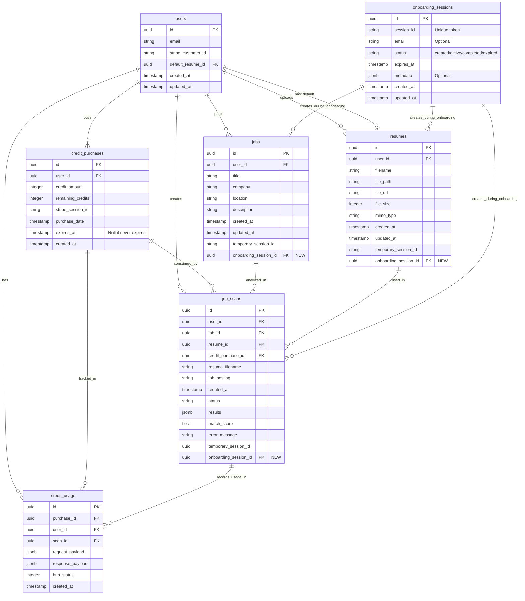

```mermaid
erDiagram
    users ||--o{ credit_purchases : buys
    users ||--o{ credit_usage : has
    users ||--o{ jobs : posts
    users ||--o{ resumes : uploads
    users ||--o{ job_scans : creates
    users ||--o| resumes : has_default
    credit_purchases ||--o{ credit_usage : tracked_in
    credit_purchases ||--o{ job_scans : consumed_by
    jobs ||--o{ job_scans : analyzed_in
    resumes ||--o{ job_scans : used_in
    job_scans ||--o{ credit_usage : records_usage_in
    
    %% New onboarding entity and relationships
    onboarding_sessions ||--o{ resumes : creates_during_onboarding
    onboarding_sessions ||--o{ jobs : creates_during_onboarding
    onboarding_sessions ||--o{ job_scans : creates_during_onboarding
    
    users {
        uuid id PK
        string email
        string stripe_customer_id
        uuid default_resume_id FK
        timestamp created_at
        timestamp updated_at
    }
    
    credit_purchases {
        uuid id PK
        uuid user_id FK
        integer credit_amount
        integer remaining_credits
        string stripe_session_id
        timestamp purchase_date
        timestamp expires_at "Null if never expires"
        timestamp created_at
    }
    
    credit_usage {
        uuid id PK
        uuid purchase_id FK
        uuid user_id FK
        uuid scan_id FK
        jsonb request_payload
        jsonb response_payload
        integer http_status
        timestamp created_at
    }
    
    resumes {
        uuid id PK
        uuid user_id FK
        string filename
        string file_path
        string file_url
        integer file_size
        string mime_type
        timestamp created_at
        timestamp updated_at
        string temporary_session_id
        uuid onboarding_session_id FK "NEW"
    }
    
    jobs {
        uuid id PK
        uuid user_id FK
        string title
        string company
        string location
        string description
        timestamp created_at
        timestamp updated_at
        string temporary_session_id
        uuid onboarding_session_id FK "NEW"
    }
    
    job_scans {
        uuid id PK
        uuid user_id FK
        uuid job_id FK
        uuid resume_id FK
        uuid credit_purchase_id FK
        string resume_filename
        string job_posting
        timestamp created_at
        string status
        jsonb results
        float match_score
        string error_message
        uuid temporary_session_id
        uuid onboarding_session_id FK "NEW"
    }
    
    %% New entity for onboarding
    onboarding_sessions {
        uuid id PK
        string session_id "Unique token"
        string email "Optional"
        string status "created/active/completed/expired"
        timestamp expires_at
        jsonb metadata "Optional"
        timestamp created_at
        timestamp updated_at
    }
```