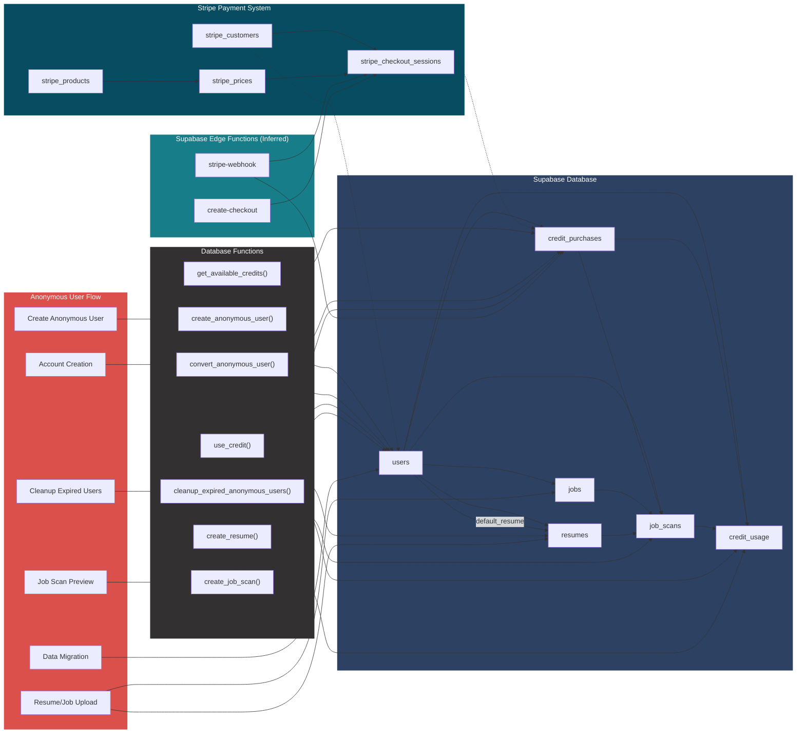

```mermaid
flowchart LR
    %% Define subgraphs for bounded contexts
    subgraph SupabaseDB["Supabase Database"]
        users["users"]
        credit_purchases["credit_purchases"]
        credit_usage["credit_usage"]
        resumes["resumes"]
        jobs["jobs"]
        job_scans["job_scans"]
    end

    subgraph StripeSystem["Stripe Payment System"]
        stripe_customers["stripe_customers"]
        stripe_products["stripe_products"]
        stripe_prices["stripe_prices"]
        stripe_checkout_sessions["stripe_checkout_sessions"]
    end

    subgraph DatabaseFunctions["Database Functions"]
        func_get_available_credits["get_available_credits()"]
        func_use_credit["use_credit()"]
        func_create_job_scan["create_job_scan()"]
        func_create_anonymous_user["create_anonymous_user()"]
        func_convert_anonymous_user["convert_anonymous_user()"]
        func_cleanup_expired["cleanup_expired_anonymous_users()"]
        func_create_resume["create_resume()"]
    end
    
    subgraph EdgeFunctions["Supabase Edge Functions (Inferred)"]
        edge_stripe_webhook["stripe-webhook"]
        edge_create_checkout["create-checkout"]
    end

    subgraph AnonymousUserFlow["Anonymous User Flow"]
        step1["Create Anonymous User"]
        step2["Resume/Job Upload"]
        step3["Job Scan Preview"]
        step4["Account Creation"]
        step5["Data Migration"]
        step6["Cleanup Expired Users"]
    end

    %% Database entity relationships
    users --> credit_purchases
    users --> credit_usage
    users --> jobs
    users --> resumes
    users --> job_scans
    users --> |default_resume|resumes
    credit_purchases --> credit_usage
    credit_purchases --> job_scans
    jobs --> job_scans
    resumes --> job_scans
    job_scans --> credit_usage

    %% Stripe entity relationships
    stripe_customers --> stripe_checkout_sessions
    stripe_products --> stripe_prices
    stripe_prices --> stripe_checkout_sessions

    %% Cross-system relationships (with dashed lines)
    stripe_customers -.-> users
    stripe_checkout_sessions -.-> credit_purchases

    %% Database function relationships
    func_get_available_credits --> credit_purchases
    func_use_credit --> credit_purchases
    func_use_credit --> credit_usage
    func_create_job_scan --> credit_purchases
    func_create_job_scan --> job_scans
    func_create_job_scan --> credit_usage
    func_create_anonymous_user --> users
    func_convert_anonymous_user --> users
    func_cleanup_expired --> users
    func_create_resume --> resumes
    func_create_resume --> users

    %% Edge function relationships (inferred)
    edge_stripe_webhook --> stripe_checkout_sessions
    edge_stripe_webhook --> credit_purchases
    edge_create_checkout --> stripe_checkout_sessions

    %% Anonymous user flow relationships
    step1 --> func_create_anonymous_user
    step2 --> resumes
    step2 --> jobs
    step3 --> func_create_job_scan
    step4 --> func_convert_anonymous_user
    step5 --> users
    step6 --> func_cleanup_expired

    %% Styling with higher contrast and darker backgrounds for better text visibility
    classDef supabase fill:#2D4263,stroke:#ffffff,stroke-width:2px,color:#ffffff
    classDef stripe fill:#084C61,stroke:#ffffff,stroke-width:2px,color:#ffffff
    classDef edgefn fill:#177E89,stroke:#ffffff,stroke-width:2px,color:#ffffff
    classDef dbfunc fill:#323031,stroke:#ffffff,stroke-width:2px,color:#ffffff
    classDef onboarding fill:#DB504A,stroke:#ffffff,stroke-width:2px,color:#ffffff

    class SupabaseDB supabase
    class StripeSystem stripe
    class EdgeFunctions edgefn
    class DatabaseFunctions dbfunc
    class AnonymousUserFlow onboarding
```