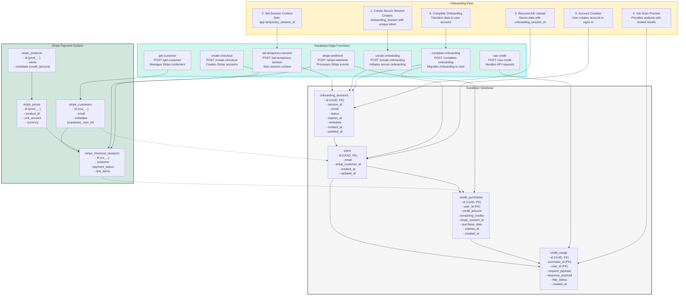

```mermaid
flowchart TB
    %% Define subgraphs for bounded contexts
    subgraph SupabaseDB["Supabase Database"]
        users["users\n- id (UUID, PK)\n- email\n- stripe_customer_id\n- created_at\n- updated_at"]
        credit_purchases["credit_purchases\n- id (UUID, PK)\n- user_id (FK)\n- credit_amount\n- remaining_credits\n- stripe_session_id\n- purchase_date\n- expires_at\n- created_at"]
        credit_usage["credit_usage\n- id (UUID, PK)\n- purchase_id (FK)\n- user_id (FK)\n- request_payload\n- response_payload\n- http_status\n- created_at"]
        onboarding_sessions["onboarding_sessions\n- id (UUID, PK)\n- session_id\n- email\n- status\n- expires_at\n- metadata\n- created_at\n- updated_at"]
    end

    subgraph StripeSystem["Stripe Payment System"]
        stripe_customers["stripe_customers\n- id (cus_...)\n- email\n- metadata (supabase_user_id)"]
        stripe_products["stripe_products\n- id (prod_...)\n- name\n- metadata (credit_amount)"]
        stripe_prices["stripe_prices\n- id (price_...)\n- product_id\n- unit_amount\n- currency"]
        stripe_checkout_sessions["stripe_checkout_sessions\n- id (cs_...)\n- customer\n- payment_status\n- line_items"]
    end

    subgraph EdgeFunctions["Supabase Edge Functions"]
        edge_stripe_webhook["stripe-webhook\nPOST /stripe-webhook\nProcesses Stripe events"]
        edge_create_checkout["create-checkout\nPOST /create-checkout\nCreates Stripe sessions"]
        edge_get_customer["get-customer\nPOST /get-customer\nManages Stripe customers"]
        edge_use_credit["use-credit\nPOST /use-credit\nHandles API requests"]
        edge_set_temporary_session["set-temporary-session\nPOST /set-temporary-session\nSets session context"]
        edge_create_onboarding["create-onboarding\nPOST /create-onboarding\nInitiates secure onboarding"]
        edge_complete_onboarding["complete-onboarding\nPOST /complete-onboarding\nMigrates onboarding to user"]
    end

    subgraph OnboardingFlow["Onboarding Flow"]
        step1["1. Create Secure Session\nCreates onboarding_session with unique token"]
        step2["2. Set Session Context\nSets app.temporary_session_id"]
        step3["3. Resume/Job Upload\nStores data with onboarding_session_id"]
        step4["4. Job Scan Preview\nProvides analysis with limited results"]
        step5["5. Account Creation\nUser creates account or signs in"]
        step6["6. Complete Onboarding\nTransfers data to user account"]
    end

    %% Relationships between database entities
    users --> credit_purchases
    users --> credit_usage
    credit_purchases --> credit_usage
    onboarding_sessions --> users

    %% Relationships between Stripe entities
    stripe_customers --> stripe_checkout_sessions
    stripe_products --> stripe_prices
    stripe_prices --> stripe_checkout_sessions

    %% Cross-system relationships (with dashed lines)
    stripe_customers -.-> users
    stripe_checkout_sessions -.-> credit_purchases

    %% Edge function relationships
    edge_stripe_webhook --> stripe_checkout_sessions
    edge_stripe_webhook --> credit_purchases
    edge_create_checkout --> stripe_checkout_sessions
    edge_get_customer --> stripe_customers
    edge_use_credit --> credit_usage
    edge_set_temporary_session --> onboarding_sessions
    edge_create_onboarding --> onboarding_sessions
    edge_complete_onboarding --> onboarding_sessions
    edge_complete_onboarding --> users

    %% Onboarding flow relationships
    step1 --> edge_create_onboarding
    step2 --> edge_set_temporary_session
    step3 --> onboarding_sessions
    step4 --> credit_usage
    step5 --> users
    step6 --> edge_complete_onboarding

    %% Styling
    classDef supabase fill:#f5f5f5,stroke:#333,stroke-width:2px
    classDef stripe fill:#d1e7dd,stroke:#0d6832,stroke-width:2px
    classDef edgefn fill:#d2f4ea,stroke:#0dcaf0,stroke-width:2px
    classDef onboarding fill:#fff3cd,stroke:#ffc107,stroke-width:2px

    class SupabaseDB supabase
    class StripeSystem stripe
    class EdgeFunctions edgefn
    class OnboardingFlow onboarding
```